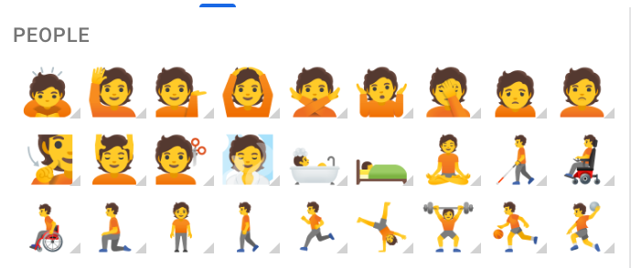
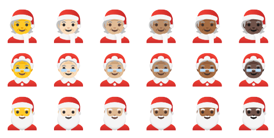

This repository provides metadata to support UX around emoji. In particular, it describes how to construct an emoji picker with full support for skin tones.

`emoji_13_1_ordering.json` describes a grid layout for an emoji picker with 9 emoji per row for Emoji 13.1. As emoji evolves new orderings will be added, such as for Emoji 14.0. A snippet is shown annotated below:

```js
  {
  	// The is the people section
    "group": "People",
    "emoji": [
      {
      	// This is the codepoint sequence for the emoji that should show in the grid
      	// Generally the base is the most neutral version available, such as the
      	// genderless gold skintone version.
        "base": [
          128583
        ],
        // These are alternate versions, typically shown as a long-press flyout
        "alternates": [
          [
            128583
          ],
          [
            128583,
            127995
          ],
          // ...etc...
        ],
        // Emoticon(s)
        "emoticons": [
          ">:P"
        ],
        // Shortcode(s)
        "shortcodes": [
          ":smirk:"
        ],
      },
```

Here is what the people section could look like:



Here are the alternates for Santa, as might be shown on long-press for the base Santa:



The https://github.com/googlefonts/noto-emoji repository provides Google's Emoji.
